# 操作步骤

## 新增用户和用户组

用户就是登录前端页面的用户

用户组的概念就是划分权限分组

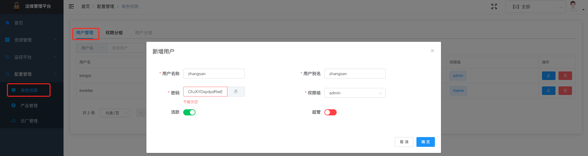

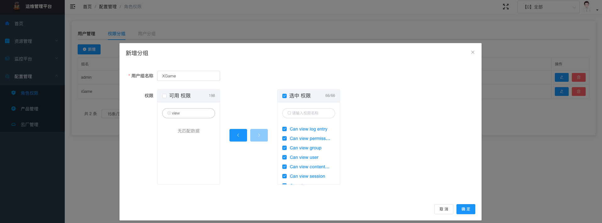

## 新增产品

产品的概念：假如你是在运维部门，那么产品可以是运维，假如有游戏项目组如 iGame 那产品就可以是 iGame

也就是一个大的分组的概念

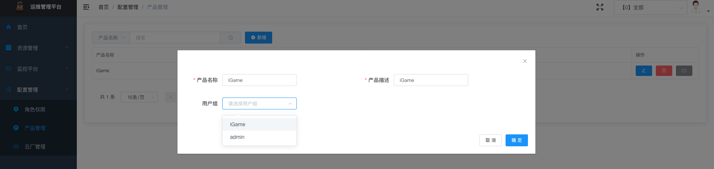

## 监控管理

采集分组：Prometheus 代理节点的分组

采集点：就是一个 Prometheus 的节点

实例类型：我们定义了监控的目标类型，如机器、K8S、MySQL、Redis 等等

标签管理：默认需要新增标签 _type=machine/k8s/mysql/redis ，新增产品的标签_product_id/_product_name

规则类型：我们定义告警规则的类型，比如是机器类的基础告警，比如是 K8S 的告警等等

大盘管理：添加一个 Grafana 大盘，在前端页面大盘列表可以跳转过去

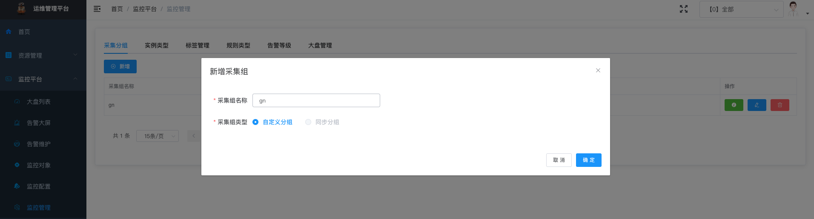

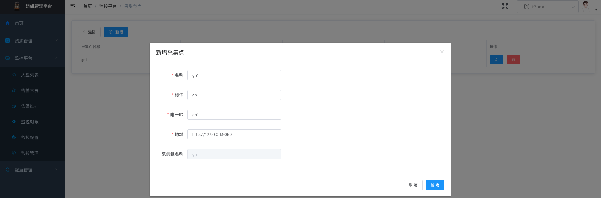


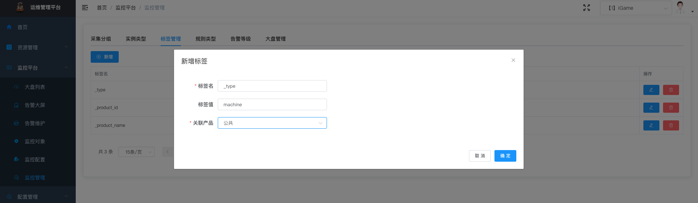

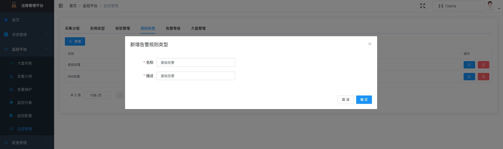

## 监控配置

任务管理：监控任务的分组，在任务管理下面添加具体的监控子任务

告警规则：就是 Prometheus 的语句

告警路由：每个产品下都有自己的默认告警路由

告警通知组：就是告警发送给谁

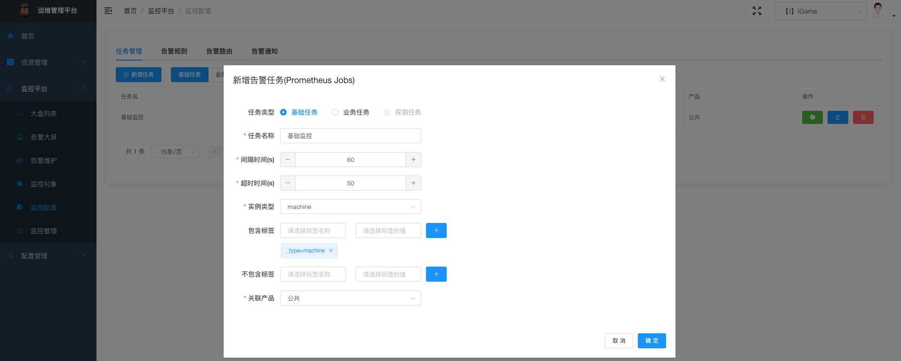

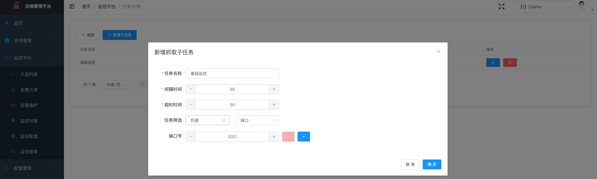

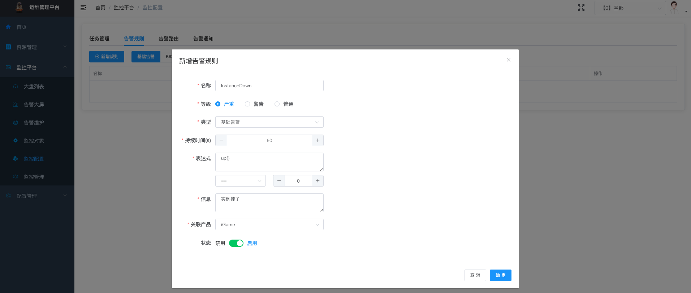

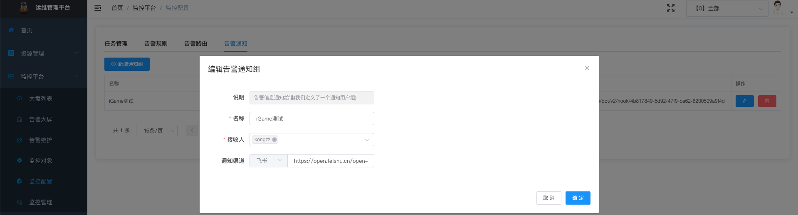

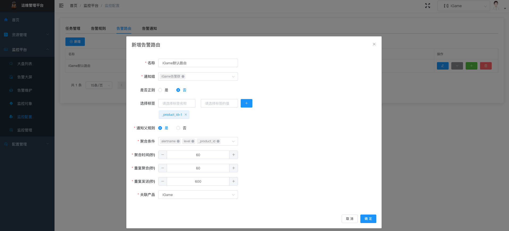

## 监控对象

监控对象：机器对象默认是从 CMDB 同步过来的，如果你没有可以手动导入或者通过后端接口导入

监控对象还有如 K8S 集群

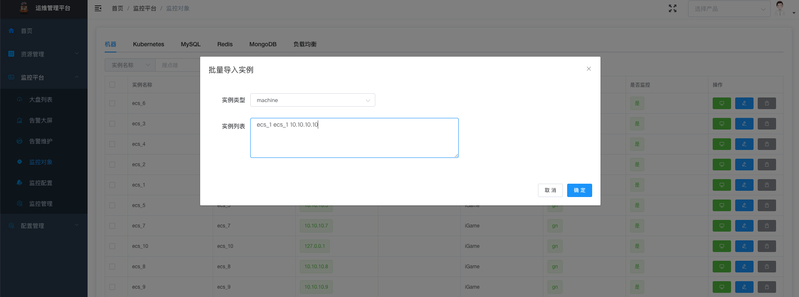

## 安装 Grafana

```sh
# Mac 直接安装启动
brew install grafana
brew services start grafana

# 默认用户名密码: admin/admin
http://127.0.0.1:3000
```

## 新增 Grafana 数据源

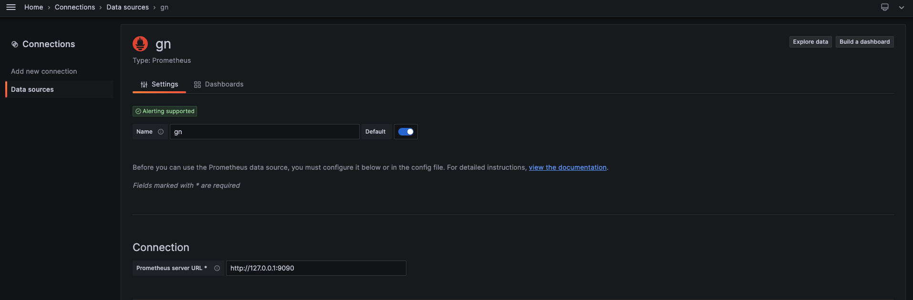

## 导入 Dashboard

导入 Grafana Dashboard，我们采用 <https://grafana.com/grafana/dashboards/1860-node-exporter-full/> ，但是还需要稍作变量调整

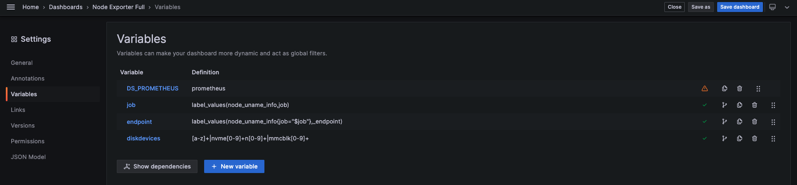

或者直接修改 dashboard 的 JSON 模型， 复制文件 ./docs/node_exporter_full.json 保存 dashboard

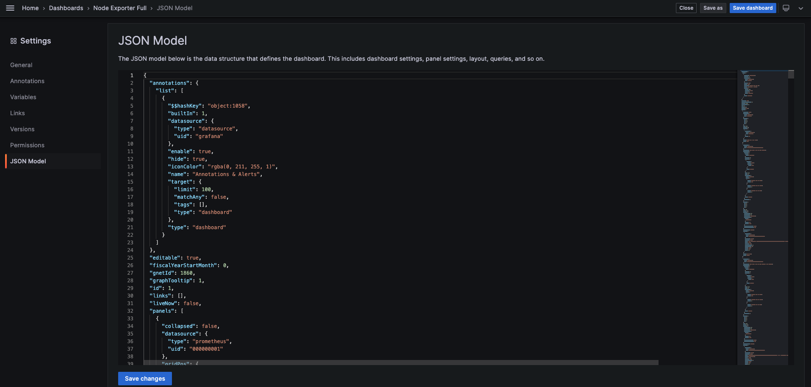

## 查看监控

在 Grafana 配置好之后，就可以在前端页面上点击跳转，看实例的监控图了

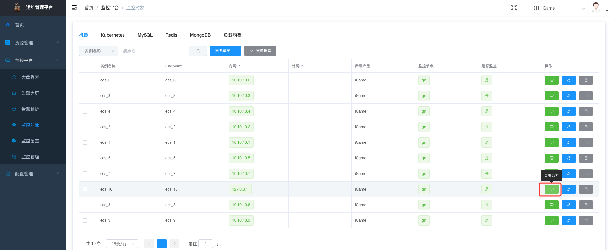

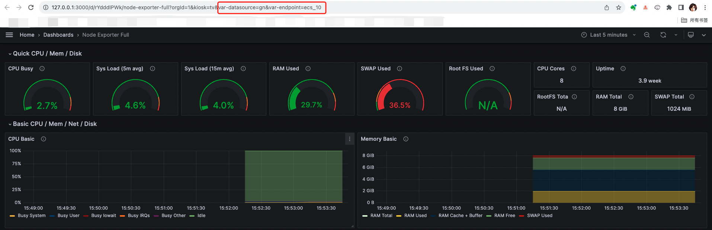

## 告警大屏

告警大屏：显示当前正在告警的产品

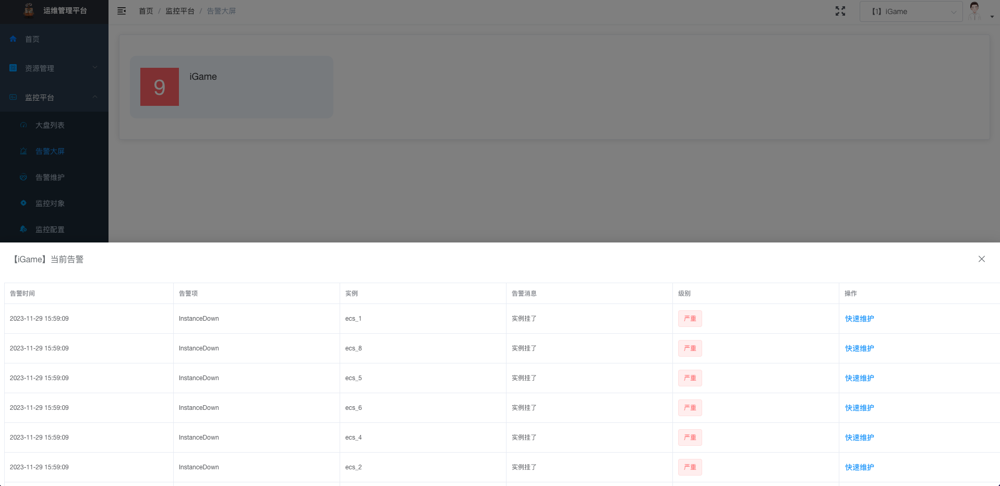
