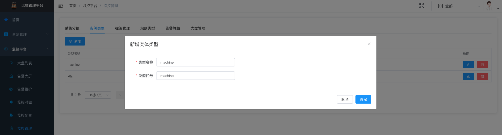

# 操作说明

## 操作步骤

### 新增用户和用户组

### 新增产品

### 监控管理

### 监控配置

### 监控对象

### 告警大屏

---

### 新增 Grafana 数据源

### 导入 Dashboard

导入 Grafana Dashboard，我们采用 https://grafana.com/grafana/dashboards/1860-node-exporter-full/ ，但是还需要稍作变量调整

或者直接修改 dashboard 的 JSON 模型， 复制文件 ./docs/node_exporter_full.json

https://prometheus.io/download/

